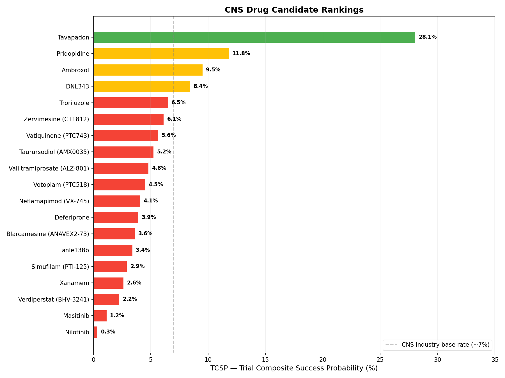
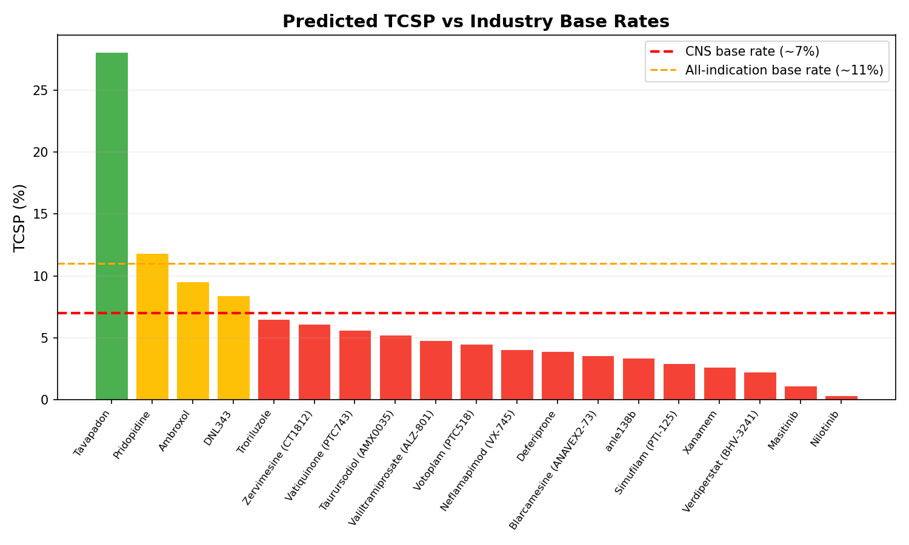
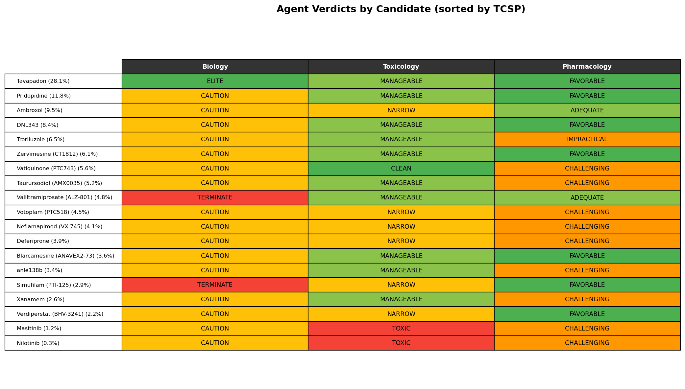
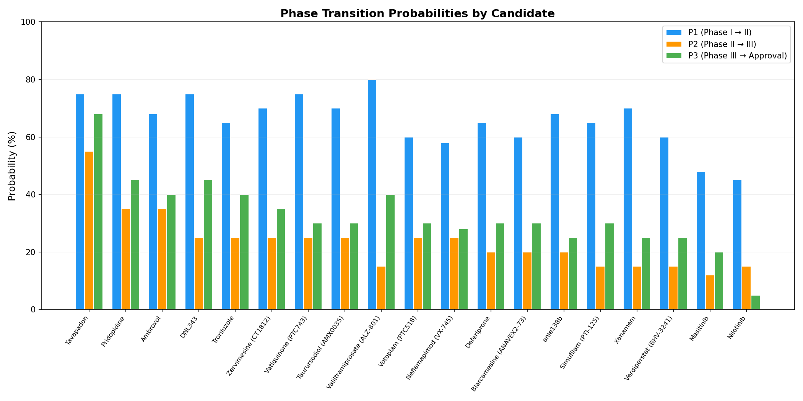
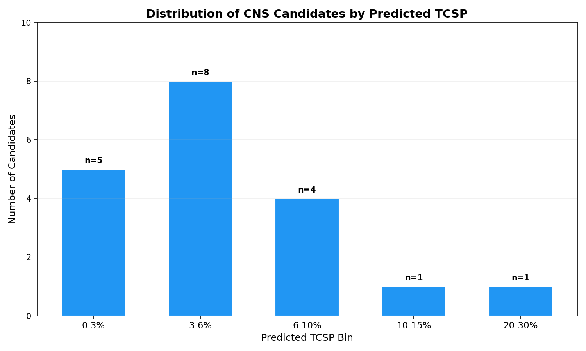

# Predicting the Outcome of 2026 CNS Clinical Trials

**Can an AI system predict which neuroscience drug candidates will succeed in the clinic — before the trials read out?**

Central nervous system (CNS) drug development is notoriously difficult. Industry-wide, only about 6–8% of CNS drugs that enter Phase I eventually reach approval — the lowest success rate of any major therapeutic area. The blood-brain barrier, the complexity of neural circuits, the unreliability of animal models, and the subjectivity of cognitive endpoints all conspire to make neurology a graveyard for promising molecules.

We applied **our agentic pipeline**, a multi-agent LLM pipeline, to 19 late-stage CNS drug candidates currently in or recently completing Phase II/III trials. The goal: rank-order these candidates by their probability of clinical success and identify the structural, biological, and pharmacological factors that separate likely winners from likely failures.

---

## The our agentic pipeline Pipeline

our agentic pipeline is a four-agent system that evaluates drug candidates from complementary expert perspectives:

1. **Biological-Rationalist (Salah)** — evaluates target validation, mechanism of action, and indication-level biological plausibility
2. **Toxi-Predictive Toxicologist** — assesses structural alerts, off-target liabilities, therapeutic window, and safety signals
3. **Pharma-Clinical Pharmacologist** — evaluates PK/PD feasibility, oral bioavailability, dosing, DDI risk, and half-life
4. **MedChem-Rationalist (Edward)** — performs blind structural assessment (Pass 1), then integrates all advisories into consensus phase-transition probabilities (Pass 2)

Each agent independently provides phase-transition probabilities:
- **P1**: Probability of advancing from Phase I to Phase II
- **P2**: Probability of advancing from Phase II to Phase III
- **P3**: Probability of advancing from Phase III to Approval

The final **Trial Composite Success Probability (TCSP)** is computed server-side as:

> **TCSP = P1 x P2 x P3**

The pipeline was validated on 394 historical small-molecule drug outcomes (AUC = 0.838) and prospectively tested on 29 drugs from the 2025 approval/failure cycle.

---

## The Candidates

We selected 19 CNS drug candidates spanning Alzheimer's disease, Parkinson's disease, ALS, Huntington's disease, Friedreich's ataxia, and spinocerebellar ataxia. All are in Phase II or III, with trial readouts expected or recently completed. The set includes both purpose-built CNS molecules and repurposed drugs.

| # | Candidate | Target | Indication | Phase |
|---|-----------|--------|------------|-------|
| 1 | Tavapadon | D1/D5 Partial Agonist | Parkinson's Disease | Ph. III Completed |
| 2 | Pridopidine | sigma-1R Agonist | ALS | Ph. III Recruiting |
| 3 | Ambroxol | GCase Chaperone | GBA-Parkinson's | Ph. II Completed |
| 4 | DNL343 | eIF2B Activator | ALS | Ph. II/III Completed |
| 5 | Troriluzole | Glutamate Modulator | Spinocerebellar Ataxia | Ph. III Active |
| 6 | Zervimesine (CT1812) | sigma-2R/TMEM97 Antagonist | Early AD | Ph. II Active |
| 7 | Vatiquinone (PTC743) | Redox/Mito Modulator | Friedreich's Ataxia | Ph. III Completed |
| 8 | Taurursodiol (AMX0035) | ER/Mito Stress Modulator | ALS | Ph. III Active |
| 9 | Valiltramiprosate (ALZ-801) | Anti-Abeta Oligomer Inhibitor | Early AD (APOE e4/e4) | Ph. III Complete |
| 10 | Votoplam (PTC518) | HTT Splicing Modulator | Huntington's Disease | Ph. III Recruiting |
| 11 | Neflamapimod (VX-745) | p38a MAPK Inhibitor | Dementia with Lewy Bodies | Ph. II Completed |
| 12 | Deferiprone | Iron Chelator | Parkinson's Disease | Ph. II Completed |
| 13 | Blarcamesine (ANAVEX2-73) | sigma-1R Agonist | Alzheimer's Disease | Ph. IIb/III Completed |
| 14 | anle138b | alpha-Synuclein Modulator | Parkinson's Disease | Ph. II Completed |
| 15 | Simufilam (PTI-125) | Filamin A | Mild-to-Moderate AD | Ph. III Completed |
| 16 | Xanamem | 11beta-HSD1 Inhibitor | AD Dementia | Ph. IIb/III Active |
| 17 | Verdiperstat (BHV-3241) | Myeloperoxidase Inhibitor | ALS | Ph. II/III Completed |
| 18 | Masitinib | Tyrosine Kinase Inhibitor | Mild-to-Moderate AD | Ph. III Recruiting |
| 19 | Nilotinib | BCR-ABL / c-Kit TK Inhibitor | Dementia with Lewy Bodies | Ph. II Recruiting |

---

## Results: The Rankings

The pipeline produced a clear rank-ordering of candidates. Here are the predicted TCSP values, sorted from most to least likely to succeed:

*Figure 1. CNS candidates ranked by predicted Trial Composite Success Probability (TCSP). Green: above all-indication base rate (11%). Yellow: above CNS base rate (7%). Red: below CNS base rate. Dashed line indicates the ~7% CNS industry average.*

### Key findings:

- **Mean predicted TCSP: 6.0%** — right at the CNS industry base rate
- **Median predicted TCSP: 4.5%** — most candidates fall below the base rate
- Only **4 out of 19** candidates exceed the 7% CNS base rate
- Only **2 out of 19** exceed the 11% all-indication base rate

This aligns with the well-documented difficulty of CNS drug development. The model is not optimistic about this cohort.

---

## The Top 5: What Makes Them Stand Out

### 1. Tavapadon (TCSP: 28.1%) — Clear Frontrunner

Tavapadon is a selective D1/D5 partial agonist for Parkinson's disease motor fluctuations. It received the highest TCSP by a wide margin and was the **only candidate** to receive an **ELITE** biology verdict. The system flagged:

- **Strong target validation**: D1/D5 dopaminergic pathway is well-established in PD motor control
- **Manageable safety profile**: partial agonist mechanism limits the overstimulation seen with full agonists
- **Favorable pharmacology**: good oral bioavailability, suitable half-life for once-daily dosing

At 28.1%, Tavapadon's predicted TCSP is 4x the CNS base rate — a strong signal.

### 2. Pridopidine (TCSP: 11.8%)

The sigma-1R agonist for ALS benefits from a favorable pharmacology profile and manageable toxicology. However, the biology agent flagged CAUTION — sigma-1R's role in ALS is biologically plausible but lacks the depth of validation seen with Tavapadon's dopaminergic target.

### 3. Ambroxol (TCSP: 9.5%)

This repurposed mucolytic as a GCase chaperone for GBA-Parkinson's disease is an interesting case. The system rated its pharmacology as merely ADEQUATE and flagged a NARROW therapeutic window — reflecting genuine concerns about achieving sufficient brain exposure at safe doses.

### 4. DNL343 (TCSP: 8.4%)

Denali's eIF2B activator for ALS via ISR modulation received favorable pharmacology and manageable toxicology, but the biology agent flagged the novelty of the integrated stress response target as a risk factor.

### 5. Troriluzole (TCSP: 6.5%)

Biohaven's glutamatergic modulator for spinocerebellar ataxia narrowly misses the CNS base rate. The pharmacology agent rated it **IMPRACTICAL** — likely reflecting the complexity of glutamate modulation dosing in a rare disease context.

---

## The Bottom 5: Red Flags

*Figure 2. Predicted TCSP for all 19 candidates against industry base rates. The CNS base rate (~7%, red dashed) and all-indication base rate (~11%, orange dashed) provide context. Most candidates cluster below the CNS base rate.*

### Nilotinib (TCSP: 0.3%) — Lowest Ranked

The repurposed BCR-ABL inhibitor for dementia with Lewy bodies received the harshest assessment: **TOXIC** from the toxicology agent and **CHALLENGING** pharmacology. This makes sense — nilotinib was designed for cancer, and its safety profile (myelosuppression, QT prolongation, hepatotoxicity) is difficult to justify in a frail dementia population.

### Masitinib (TCSP: 1.2%)

Another repurposed kinase inhibitor, masitinib also received a **TOXIC** verdict. Tyrosine kinase inhibitors carry significant off-target risks that are tolerable in oncology but problematic for chronic neurodegenerative use.

### Simufilam (TCSP: 2.9%)

Cassava Sciences' filamin A modulator received a **TERMINATE** biology verdict — the system flagged fundamental concerns about the target's role in Alzheimer's pathology. This aligns with the well-publicized scientific controversy surrounding simufilam's mechanism.

---

## Agent Verdicts: Where Candidates Diverge

*Figure 3. Agent verdicts for each candidate, sorted by TCSP. Green indicates favorable assessment, yellow indicates caution, red indicates severe concern.*

The verdict heatmap reveals a pattern: **biology is the great equalizer in CNS**. Nearly all candidates receive CAUTION from the biology agent — reflecting the inherent uncertainty of CNS target validation. The differentiation comes from:

1. **Toxicology** — the sharpest discriminator. Only Tavapadon, Pridopidine, and a handful of others clear the MANAGEABLE bar. Repurposed oncology drugs (nilotinib, masitinib) are flagged as TOXIC.
2. **Pharmacology** — separates candidates with practical dosing regimens (FAVORABLE) from those with challenging PK/PD profiles (CHALLENGING, IMPRACTICAL).

---

## Phase-Level Probabilities: Where Do Candidates Fail?

*Figure 4. Predicted phase-transition probabilities (P1, P2, P3) for each candidate. P2 (Phase II to Phase III) is consistently the bottleneck across the cohort.*

A striking pattern emerges: **Phase II is the predicted bottleneck for nearly every CNS candidate**. P2 (Phase II → III) is consistently the lowest of the three probabilities. This matches the real-world data — Phase II is where CNS drugs disproportionately fail, typically due to lack of efficacy in proof-of-concept studies.

Tavapadon is the exception: its P2 is substantially higher than the rest of the field, reflecting strong target validation and mechanism confidence.

---

## Distribution of Predictions

*Figure 5. Distribution of predicted TCSP across the 19 candidates. The majority cluster in the 2–6% range, below the CNS industry base rate.*

The distribution is heavily right-skewed, with a single outlier (Tavapadon at 28.1%) and the bulk of candidates compressed into the 2–6% range. This compression is itself informative — the model sees most of these candidates as having roughly similar (low) chances, with only a few distinguishing themselves.

---

## Limitations and Caveats

Several important caveats apply to these predictions:

1. **No access to clinical data**: The pipeline evaluates candidates based on molecular structure, target biology, and indication context. It does not have access to actual trial data, interim results, or proprietary formulation details.

2. **TCSP compression**: The raw TCSP values are multiplicatively compressed (P1 x P2 x P3 tends to produce small numbers). While a post-hoc calibration (R² = 0.875) maps these to more interpretable probabilities, the **ranking** is more reliable than the **absolute values**.

3. **Combination effects**: Some of these candidates may be tested in combination with other therapies. The pipeline evaluates molecules individually.

4. **Temporal knowledge cutoff**: The LLM's training data has a knowledge cutoff. Candidates with very recent mechanism-of-action discoveries may be under- or over-estimated.

5. **Small sample, hard problem**: With only 19 candidates in the most difficult therapeutic area, any model's predictions should be taken as probabilistic guidance, not deterministic forecasts.

---

## What to Watch

Based on these predictions, we highlight three candidates to watch closely:

**Tavapadon** stands alone as the clear predicted winner. With the only ELITE biology verdict, manageable safety, and favorable pharmacology, it has the profile of a drug that could genuinely reach patients. Its Phase III has completed — the readout will be a strong test of the model.

**Pridopidine** and **Ambroxol** represent the next tier. Both have plausible mechanisms and manageable profiles, but each carries meaningful risk — Pridopidine from the sigma-1R evidence base, Ambroxol from the brain exposure challenge.

At the other end, **Nilotinib** and **Masitinib** — both repurposed kinase inhibitors — face an uphill battle. The model's TOXIC verdicts reflect a genuine mismatch between oncology safety profiles and the chronic, vulnerable CNS patient populations these drugs are targeting.

---

## Methodology Note

our agentic pipeline uses Google Gemini 3 Pro Preview as its base LLM, running four specialized agent prompts in parallel via a ThreadPoolExecutor architecture. The system was validated on:

- **Global dataset**: 394 historical small-molecule outcomes (AUC = 0.838)
- **2025 holdout**: 29 prospective drug outcomes from the 2025 approval/failure cycle
- **Eisai portfolio**: 40 clinical trial programs (37 approved, 3 withdrawn — all 3 withdrawn correctly ranked lowest)

The TCSP is computed server-side as the product of three consensus phase-transition probabilities. A post-hoc linear calibration (slope = 2.67, intercept = 0.08) corrects for multiplicative compression.

Full code and data are available in the Edward-Salah repository.

---

*Analysis performed March 2026 using our agentic pipeline.*
